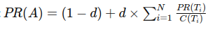

## Applications
### Finding Page's Rank
>The code for the following function can be found in [page_rank.cpp](Application/page_rank.cpp) 
This C++ code implements the PageRank algorithm using OpenMP to parallelize the iterative computation of rank values for each node in a directed graph. The algorithm distributes the workload across multiple threads to compute the PageRank efficiently, with each iteration updating the ranks based on incoming links and the damping factor. 
>The basic idea of PageRank is that if a page has many incoming links (or important links), it is considered more important. The algorithm involves iteratively updating the rank of each page based on the ranks of the pages linking to it. 
>The formula is: 

>Where:
>*   **PR(A)** is the PageRank of page A.
>*   **d** is the damping factor (usually set to 0.85).
>*   **T_i** are pages that link to page A.
>*   **C(T_i)** is the number of outbound links on page \( T_i \).

### Histogram
>This program demonstrates a parallel approach to distribute the task of counting data points that fall within certain ranges (or "bars") among multiple processes and threads using MPI (Message Passing Interface) and OpenMP (Open Multi-Processing). 
The purpose of the program is to categorize points into different bars, much like a histogram, where each bar represents a range of values. The points are read from a file, and the counting is performed in parallel using both distributed and shared memory. 
The code for the following function can be found in [histo.cpp](src/Histogram/histo.cpp) 

## 0.4) Motivation
>There are many more practical situations and algorithm that uses OpenMP and MPI. One can try to use OpenMP to solve complex algorithm using Multithreading and many more concepts of Parallel Programming. 
### note
>For contribution refer to [contribution guidelines](src/Contributing.md)

